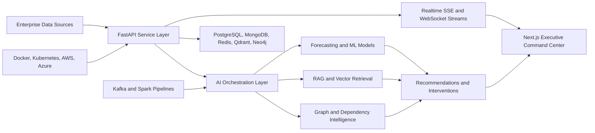

# NEXUSMIND AI - Enterprise Impact Brief

## Product Positioning

NEXUSMIND AI is an Autonomous Enterprise Intelligence & Simulation Platform for detecting strategic failure before it becomes attrition, project delay, client escalation, knowledge loss, insider risk, or revenue leakage.

The product presents an AI-powered virtual enterprise universe: digital twins, autonomous AI managers, enterprise memory, simulations, forecasts, global risk intelligence, and executive copilots connected into one command workflow.

## Business Value

The platform is designed around measurable enterprise outcomes:

| Business problem | AI system | Executive value |
| --- | --- | --- |
| Talent attrition | Talent continuity forecasting and retention recommendations | Reduces replacement cost and knowledge-transfer loss. |
| Burnout and wellness decline | Mental wellness, voice stress, work-life balance, and workload intelligence | Prevents capacity collapse and productivity drag. |
| Project failure | Delivery-risk forecasting, digital twin simulation, and resource allocation | Reduces delay penalties, missed commitments, and escalation cost. |
| Hiring inefficiency | Resume NLP, semantic matching, ranking, fraud detection, and recruiter analytics | Improves hiring precision and reduces recruiting waste. |
| Meeting overload | Meeting waste detector and productivity leakage models | Recovers deep-work time and reduces operating drag. |
| Insider threat | Behavioral anomaly detection and SOC alerting | Detects access drift, risky exports, and privileged-action anomalies. |
| Knowledge loss | RAG memory, expertise graph, SOP generation, and dependency scoring | Preserves institutional knowledge before employees leave. |
| Client dissatisfaction | Churn, escalation, sentiment, delivery quality, and revenue-at-risk forecasting | Protects renewals and executive account health. |

## Enterprise Architecture

## Demo Flow for Recruiters and Judges

1. Start with the AI CEO Assistant and ask for the biggest company risk.
2. Show the Digital Twin ecosystem updating company, department, team, project, client, and workforce state.
3. Open the AI Shadow Company and compare real state against simulated future branches.
4. Run the What-If Decision Engine for hiring, budget, expansion, client-loss, or restructuring scenarios.
5. Run the AI Crisis Simulator and generate an impact analysis plus recovery plan.
6. Show AI Emotion Radar for burnout, morale, stress, conflict, and engagement signals.
7. Open the Enterprise Metaverse Control Room to inspect the 3D virtual company environment.
8. Finish with Executive Recommendations synthesized by the autonomous AI manager council.

## Why It Feels Enterprise-Grade

- It covers cross-company workflows instead of one isolated administrative task.
- It converts analytics into interventions and ROI, not just charts.
- It has authenticated APIs, typed schemas, realtime streams, frontend proxy routes, and automated tests.
- It includes ML, NLP, graph intelligence, vector retrieval, RAG, event streaming, and cloud-native deployment assets.
- It exposes an auditor panel that evaluates startup quality, recruiter signal, judge impact, research depth, and residual risk.

## Current Validation Baseline

- Backend test suite: 46 passing API and integration tests.
- Frontend gates: typecheck, lint, audit, and production build passing.
- Runtime verification: backend health, authenticated platform APIs, GenAI streaming, realtime SSE, WebSocket stream, and frontend proxy routes verified.
- Known local limitations: Docker, Terraform, Azure CLI, Java CLI, and GPU are not installed locally; deployment manifests and imports are verified statically, and containerized Spark includes OpenJDK.
